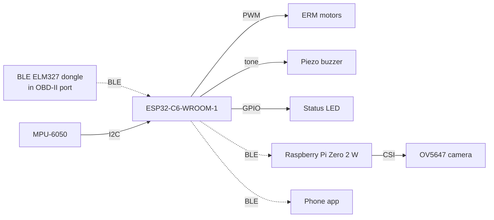

# DRIFTS — Hardware Specification

**Target MCU:** ESP32-C6-WROOM-1 (ESP32-C6-DevKitC-1)
**Revision:** BLE dongle data path · 2026-09-30

This folder is the authority for pin assignments. `esp32/drifts_esp32/config.h`
must match the table below — if they disagree, one of them is a bug.

---

## 1. System overview

**There is no wired connection to the vehicle.** The OBD link is Bluetooth LE
to a dongle. This is a change from the earlier design and it removes the
SN65HVD230 transceiver, the J1962 pigtail and all bus-tapping risk.

---

## 2. Pin connection table

| GPIO | Direction | Component | Signal | Notes |
| --- | --- | --- | --- | --- |
| **10** | Out (LEDC PWM) | ERM vibration motor array | MOSFET gate, via 100 Ω | 20 kHz, 8-bit duty. **Never direct to motor** |
| **11** | Out (LEDC tone) | Piezo buzzer | MOSFET gate, via 100 Ω | `ledcWriteTone`, 2.7 kHz nominal |
| **2** | Out | Status LED | Anode via 330 Ω | **External LED.** Lit when the Pi is subscribed |
| **21** | Bidir (I2C) | MPU-6050 | SDA | `Wire.begin(21, 22)` — must be explicit |
| **22** | Out (I2C) | MPU-6050 | SCL | 400 kHz |
| 3V3 | Power | MPU-6050 | VCC | 3.3 V only |
| GND | Power | All | Common | See grounding, §5.4 |

### Reserved — do not assign

| GPIO | Why |
| --- | --- |
| 4, 5, 8, 9, 15 | Strapping pins, latched at reset. GPIO 9 is BOOT; GPIO 8 is the on-board RGB LED |
| 12, 13 | USB Serial/JTAG D− / D+. Reassigning kills the native USB port |
| 16, 17 | UART0 console (TXD0 / RXD0) |
| 14, 24–30 | **Not bonded out on the WROOM-1 module.** 24–30 are the SPI flash bus |

### ⚠ The failure mode that has no error message

GPIO **25** and **26** were the motor and buzzer pins on the ESP32-WROOM-32 this
project started on. On the C6 they are `SPIQ` (flash MISO) and `SPIWP` (flash
write-protect).

The C6's GPIO validity mask covers 0–30, so **`ledcAttach(26, …)` returns
`true`** and `digitalWrite(25, …)` compiles and runs. Nothing warns you. The
symptom is flash corruption or a boot loop, with no indication the pins are the
cause. If anything is currently soldered to 25 or 26, move it before power-up.

---

## 3. Key components

| Ref | Component | Qty | Key spec | Why this part |
| --- | --- | --- | --- | --- |
| U1 | ESP32-C6-DevKitC-1 | 1 | RISC-V, 160 MHz, BLE 5.0, 8 MB flash | BLE-only, single core — see §5.6 |
| U2 | Raspberry Pi Zero 2 W | 1 | Quad A53, 512 MB | Camera + CNN inference |
| U3 | BLE ELM327 dongle | 2 | **Bluetooth LE**, not Classic | Veepeak OBDCheck BLE+ / Vgate iCar Pro BLE 4.0 |
| U4 | MPU-6050 breakout | 1 | ±2 g, I2C 0x68, 3.3 V | Harsh-brake detection |
| U5 | OV5647 camera | 1 | 640×480, CSI | Connects to Pi, not the C6 |
| Q1 | Logic-level N-MOSFET | 1 | V_GS(th) < 2 V, I_D > 1 A | AO3400A, 2N7002 (small loads), or IRLZ44N |
| Q2 | Logic-level N-MOSFET | 1 | same | Buzzer driver |
| D1 | Flyback diode | 1 | 1N4148 or 1N4001 | **Mandatory** across the motor |
| M1 | ERM vibration motors | 4 | ~3 V, 60–100 mA each | Seat haptics |
| LS1 | Passive piezo buzzer | 1 | 3–5 V, driven by tone | Must be *passive* — an active buzzer ignores frequency |
| — | 5 V buck converter | 1 | 12 V in, **3 A** out | Vehicle power, §5.5 |

**The dongle must say "Bluetooth LE" or "BLE".** The ESP32-C6 has no Classic
Bluetooth radio at all — a Classic ELM327 cannot work on this hardware under
any firmware.

---

## 4. Current budget

| Load | Typical | Peak |
| --- | --- | --- |
| Raspberry Pi Zero 2 W | 120 mA | **1400 mA** |
| ESP32-C6 (3 BLE links) | 80 mA | 300 mA |
| ERM motors, 4× | 0 mA (idle) | 400 mA |
| Piezo buzzer | 0 mA | 30 mA |
| MPU-6050 | 4 mA | 4 mA |
| **Total @ 5 V** | **~200 mA** | **~2.1 A** |

Specify the 5 V rail at **3 A**. Undersizing it is the leading cause of SD-card
corruption and random reboots in Pi-in-car builds, and the failure looks like a
software bug.

Note the peak column is worst-case simultaneous: the Pi only draws 1.4 A under
CNN inference, which is exactly when an alert may also fire. Do not size for the
typical column.

---

## 5. Design considerations

### 5.1 Motor driver — never drive a motor from a GPIO

A C6 GPIO sources tens of milliamps. Four ERM motors draw ~400 mA and are
**inductive**: when the transistor switches off, the collapsing field produces a
reverse voltage spike that will destroy the GPIO, the MCU, or both.

Required, per motor branch:

- **Logic-level** N-MOSFET. "Logic level" is not optional — a standard 2N7000
  is specified at V_GS = 10 V and will run hot and lossy at the C6's 3.3 V gate
  drive. Use a part with V_GS(th) below 2 V.
- **Flyback diode** across the motor terminals, cathode to +V. This is the
  single most commonly omitted part and the one that kills boards.
- **100 Ω gate series resistor** to limit inrush into the gate capacitance.
- **10 kΩ gate pull-down** to ground, so the motor stays off while the C6 is in
  reset and the pin is floating. Without it the motor can buzz during boot.

### 5.2 Motor voltage — a firmware/hardware interaction

ERM motors are typically rated **3 V**. If they hang off the 5 V rail, they run
hot and die early.

Two fixes, pick one and write it down:

- **Series resistor** per motor: `R = (5 − V_motor) / I_motor`. For a 3 V,
  80 mA motor that is `(5 − 3)/0.08 = 25 Ω`, dissipating 0.16 W — use 27 Ω,
  0.5 W.
- **Cap the PWM duty in firmware.** `ledcWrite` is 8-bit, so duty 160/255 ≈ 63%
  averages about 3.1 V from a 5 V rail. This is free and adjustable.

**If you take the firmware route, `DROWSY_VIB_DUTY` in `config.h` is currently
255** — full 5 V. Change it to ~160, or add the resistors. Whoever does the
wiring and whoever sets that constant must agree; this is the kind of mismatch
that is invisible until the motors fail on demo day.

### 5.3 Buzzer

Use a **passive** piezo element. An active buzzer contains its own oscillator
and emits one fixed tone regardless of what `ledcWriteTone` does, which makes
the multi-tier alert audibly identical at every level.

At ~30 mA a small piezo is near the GPIO's limit. Drive it through Q2 rather
than directly.

### 5.4 Grounding — star, not daisy-chain

Motor switching produces current spikes. If the motor return current flows
through the same conductor as the MPU-6050's ground reference, the resulting
ground bounce shows up as I2C errors and accelerometer noise — and it will look
like a flaky sensor, not a wiring fault.

Bring the motor ground and the logic ground back to **one point at the supply**.
Keep the I2C ground return short and away from motor leads.

Add **100–470 µF bulk capacitance** at the motor supply to absorb switch-on
inrush.

### 5.5 Power source — take it from the accessory socket

The move to a BLE dongle has a side benefit worth taking: **nothing needs to
connect to the OBD-II connector any more.**

Earlier designs tapped OBD pin 16 for 12 V. That pin is unswitched battery —
live with the key off and the car locked — which is how a project flattens
someone's battery over a weekend. Use the **12 V accessory / cigarette lighter
socket** instead, which on most vehicles is ignition-switched. The problem
disappears rather than being managed.

The dongle itself still sits on unswitched power. Pick one with a documented
sleep mode, and unplug it between test sessions regardless.

For bench and demo work, a **USB power bank** is simpler and safer than any of
this. Use one until the system needs to be in a moving car.

### 5.6 The C6 is single-core — this constrains the architecture

The BLE controller, the BLE host and `loop()` share one 160 MHz core. Anything
blocking in `loop()` directly delays BLE housekeeping and can drop one of the
three connections.

This is why the design keeps the ESP32 doing I/O only — CAN-equivalent input,
actuator output — with all scoring on the Pi. That split is load-bearing, not
just tidy. Hardware implication: do not add sensors to the C6 that need blocking
reads or tight timing loops.

Three concurrent BLE connections (dongle + Pi + phone) is also a **hard
ceiling** — the prebuilt Arduino controller is compiled with
`CONFIG_BT_LE_MAX_CONNECTIONS=3`. There is no fourth link available for a
future addition.

### 5.7 IMU mounting — decide the axis before you glue anything

`IMU_LONG_AXIS` and `IMU_LONG_SIGN` in `esp32/drifts_esp32/imu.h` define which
accelerometer axis points along the vehicle and which direction counts as
braking.

Mount the board so **one axis lies along the direction of travel**, and record
which. Get the sign wrong and hard braking registers as hard acceleration —
every brake event count becomes meaningless, and nothing in the system will tell
you.

Verify once on a test drive: brake firmly, confirm `[IMU] Harsh brake` appears
on the serial console.

The startup calibration assumes the vehicle is **stationary and level**. On a
slope it bakes a gravity component into the bias.

### 5.8 Enclosure

Dashboard-mounted or windshield suction cup — **not** the visor clip in the
original report. The camera needs a stable view of the driver's face, and the
IMU needs a rigid mount to the vehicle body: anything that can rock or rotate
adds acceleration that is not the vehicle's.

Do not obstruct driver sightlines. Route cables clear of the steering wheel,
pedals and airbag deployment paths.

---

## 6. Open items for the hardware team

- [ ] Confirm the ERM motor part and its rated voltage and stall current — §5.2 depends on it
- [ ] Choose the motor voltage approach: series resistors or PWM duty cap, and update `config.h` to match
- [ ] Confirm the buzzer is passive, not active
- [ ] Decide the IMU mounting axis and record it in `imu.h`
- [ ] Confirm the MPU-6050 breakout's onboard I2C pull-ups (usually 4.7 kΩ) — do not add a second set
- [ ] Verify nothing is wired to GPIO 25 or 26 before first power-up

## 7. Files here

| File | Contents |
| --- | --- |
| `README.md` | This document |
| `schematic.md` | Driver circuits, power tree, connector detail |
| `BOM.csv` | Bill of materials |
| `pinout.csv` | Pin map as data, for diffing against `config.h` |
