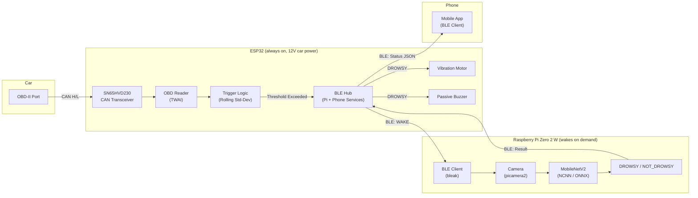

# DRIFTS v2 — Driver Fatigue Detection and Intervention System

DRIFTS v2 couples vehicle CAN bus telemetry with edge machine learning (MobileNetV2) to deliver low-power, real-time driver drowsiness detection.



---

## System Overview

1. **Passive CAN Sniffing:** The ESP32 continuously reads standard OBD-II PIDs (RPM, speed, throttle, brake deceleration) in safe listen-only mode.
2. **Anomaly Triggering:** Rolling statistical windows detect erratic driving (hard braking, RPM fluctuation, speed drifting, throttle jitter).
3. **On-Demand Pi Wake:** When an anomaly is detected, the ESP32 notifies the Raspberry Pi Zero 2 W with a `WAKE` command over BLE.
4. **MobileNetV2 Edge Inference:** The Pi powers on the camera (`picamera2`), captures frames, and runs a MobileNetV2 classifier trained on the `Simuletic_DMS_Dataset` (`Open`, `Closed`, `Drowsy/Microsleep`).
5. **Intervention & Telemetry:** If drowsiness is detected, the Pi reports `DROWSY` to the ESP32, which triggers haptic vibration and audio alerts. Telemetry is streamed to the mobile companion app via a separate BLE service.
6. **Power Conservation:** The Pi camera and ML inference remain off during normal driving, conserving CPU and power.

---

## Repository Structure

```
├── .gitattributes
├── .gitignore
├── README.md
├── coding_plan_DRIFTS
├── Simuletic_DMS_Dataset/          # Per-frame classification dataset
│   ├── images/                     # 168 driver face images
│   └── labels/                     # JSON annotations (eye_state, perclos, head pose)
│
├── raspberry/                      # ── Raspberry Pi Zero 2 W ──
│   ├── config.toml                 # Pi runtime settings (BLE, camera, detector, power)
│   ├── requirements.txt            # Pi dependencies
│   │
│   ├── drifts/                     # Pi package (python -m drifts)
│   │   ├── __init__.py             # Version & package marker
│   │   ├── __main__.py             # CLI entry point
│   │   ├── config.py               # Dataclasses & config loader
│   │   ├── app.py                  # Main loop: IDLE -> WAKE -> ANALYZING -> COOLDOWN
│   │   ├── ble_client.py           # BLE connection to ESP32 (bleak)
│   │   ├── camera.py               # On-demand picamera2 capture with fallbacks
│   │   └── detector.py             # MobileNetV2 inference (NCNN / ONNX / PyTorch)
│   │
│   ├── model/                      # Trained model weights & label mapping
│   │   ├── README.md               # Model setup guide
│   │   ├── labels.txt              # 0: Open, 1: Closed, 2: Drowsy/Microsleep
│   │   ├── mobilenetv2_dms.param   # NCNN model structure
│   │   └── mobilenetv2_dms.bin     # NCNN weights
│   │
│   ├── training/                   # GPU machine training pipeline
│   │   ├── README.md               # Training & export instructions
│   │   ├── dataset.py              # PyTorch Dataset for Simuletic DMS
│   │   ├── train.py                # MobileNetV2 fine-tuning script
│   │   ├── export_ncnn.py          # PyTorch -> ONNX -> NCNN exporter
│   │   └── requirements_training.txt # PyTorch, Torchvision, ONNX
│   │
│   ├── deploy/                     # Pi deployment
│   │   ├── deploy.ps1              # PowerShell packing and deployment
│   │   ├── install.sh              # One-time Pi setup (ncnn, picamera2, venv)
│   │   └── drifts.service          # systemd unit for automatic startup
│   │
│   ├── scripts/
│   │   └── maint.sh                # Maintenance mode helper
│   │
│   └── tests/
│       ├── test_config.py          # Configuration unit tests
│       └── test_detector.py        # Detector unit tests with Simuletic frames
│
├── esp32/                          # ── ESP32 Firmware ──
│   └── drifts_esp32/
│       ├── drifts_esp32.ino        # Main sketch
│       ├── config.h                # Pinouts, thresholds, BLE UUIDs
│       ├── obd_reader.h / .cpp     # TWAI CAN bus OBD-II reader
│       ├── trigger.h / .cpp        # Rolling window anomaly evaluation
│       ├── ble_hub.h / .cpp        # Dual-service BLE server (Pi & Phone)
│       └── actuators.h / .cpp      # Haptic motor & buzzer pulse engine
│
└── tools/                          # Developer Utilities
    ├── ble_scan.py                 # Scan for DRIFTS ESP32 hub
    └── send_cmd.py                 # Interactive BLE command tool
```

---

## 1. Running on Desktop / Laptop

You can run the Pi pipeline locally with simulated events without physical hardware:

```bash
# Run standalone with simulated triggers
python -m drifts --sim --no-ble --debug
```

Run tests:
```bash
python -m pytest
```

---

## 2. Flashing the ESP32

1. Open Arduino IDE or PlatformIO.
2. Select **ESP32 Dev Module** (ESP32 Arduino core 3.x or 2.x).
3. Open `esp32/drifts_esp32/drifts_esp32.ino`.
4. Verify pin configurations in `config.h`:
   - `MOTOR_PIN = 26`
   - `BUZZER_PIN = 25`
   - `CAN_TX_PIN = 21`, `CAN_RX_PIN = 22`
5. Upload the sketch and monitor Serial at `115200` baud.
6. Serial test commands:
   - `WAKE`: Manually trigger Pi analysis
   - `SIM 2500 70 25`: Inject OBD values (RPM, Speed km/h, Throttle %)
   - `STOP`: Stop all actuators

---

## 3. Training MobileNetV2

Train on a GPU workstation or Google Colab using `Simuletic_DMS_Dataset`:

```bash
cd training
pip install -r requirements_training.txt
python train.py --epochs 30 --batch-size 16
python export_ncnn.py --weights runs/best_model.pth --output-dir ../model
```

Copy the generated `.param` and `.bin` (or `.onnx`) files into `model/`.

---

## 4. Deploying to Raspberry Pi Zero 2 W

From PowerShell on your development machine:

```powershell
# First-time installation:
powershell -ExecutionPolicy Bypass -File .\deploy\deploy.ps1 -Install

# Subsequent updates:
powershell -ExecutionPolicy Bypass -File .\deploy\deploy.ps1
```

Watch live logs on the Pi:
```bash
journalctl -u drifts -f
```
